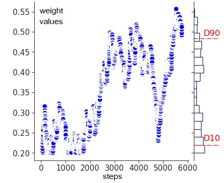
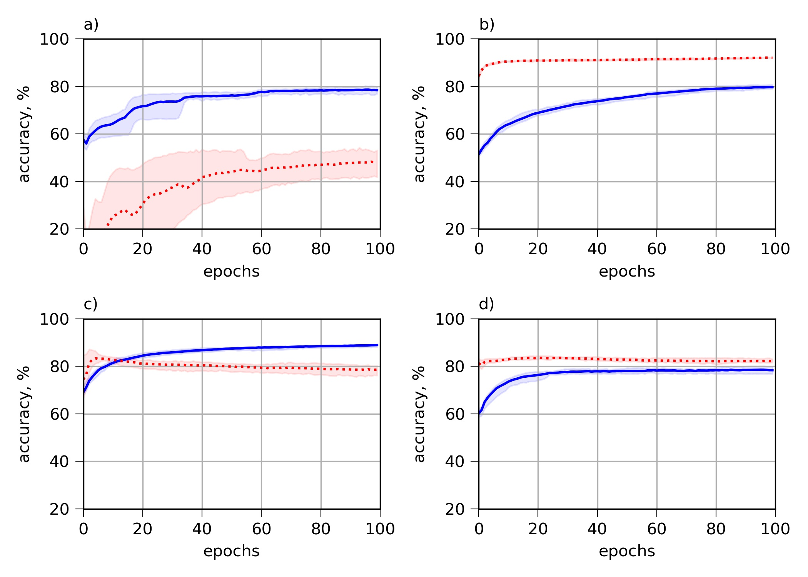

# __Prevention mechanisms of Catastrophic Forgetting in Spiking Neural Networks__
The code illustrates [the result reported at the XXIV International Conference on Artificial Neural Networks NEUROINFORMATICS-2022](https://www.researchgate.net/publication/368316712_Prevention_mechanisms_of_Catastrophic_Forgetting_in_Spiking_Neural_Networks_in_Russian) at MIPhT (Moscow Institute of Physics and Technology), Moscow, Russia.

### __ARTICLE:__     

Antonov, D., Sukhov, S. Prevention mechanisms of Catastrophic Forgetting in Spiking Neural Networks. XXIV International Conference on Artificial Neural Networks NEUROINFORMATICS-2022, p.55-64
***
Abstract: Artificial neural networks experience catastrophic forgetting during continuous learning. The peculiarities of spiking neural networks (SNNs) provide additional mechanisms for mitigating of catastrophic forgetting. In this paper, we study the effect of lateral inhibition and proper account of neurons’ importance for catastrophic forgetting prevention in SNNs. The experiments were performed on freely available datasets in the [SpykeTorch](https://github.com/miladmozafari/SpykeTorch) framework.
***
__The code is written in Python 3.8 using the [SpykeTorch](https://github.com/miladmozafari/SpykeTorch) framework__
***   
Let us train a spiking neural network (SNN) on a certain data set, access to which will no longer be available after training. And then train the network on a new data set. It is necessary to ensure that training the SNN on new data does not lead to forgetting the old data.    

Catastrophic forgetting can be caused by _overlapping patterns of neuron activity for previous and new data_. By reducing this overlap, it is possible to avoid unwanted interference of activities during continuous learning. Interference can be reduced by _creating sparse neuronal activity_. One of the mechanisms that ensure sparse activity is __lateral inhibition__. We investigated the effect of lateral inhibition on the suppression of catastrophic forgetting in SNNs.     

Another common way to prevent catastrophic forgetting is based on __determining the importance of weights__: the values ​​of the most important weights during continuous learning are tried to be preserved to a greater extent, which prevents forgetting of previous information. The use of this approach in SNNs has its own characteristics. Local rules for training SNNs imply the absence of a global loss function and the impossibility of calculating gradients. This prevents the use of many weight importance determination methods developed for analog networks.      

__We developed an original method that links the importance of a given weight with an acceptable range of its variation. The range of acceptable weight variation was determined using Langevin dynamics in the weight space.__     

__The algorithm for preventing catastrophic forgetting__ is as follows:    

__Stage I.__ training on the initial dataset in the usual way   

__Stage II.__ continue training on the initial set with the addition of Gaussian noise:     

__∆𝑤𝑖𝑗=𝐹(𝑤𝑖𝑗)+ 𝜎𝑁(0,1)__ ,      

where    
- ∆𝑤𝑖𝑗 is weight change (indices 𝑖 and 𝑗 are indicated post- and pre-synaptic neurons)
- 𝐹(𝑤𝑖𝑗) determines the magnitude of the change in the relationship between 𝑖 and 𝑗 neurons
- 𝑁(0,1) is standard normal distribution
- 𝜎 is noise amplitude    

__Stage III.__ determining acceptable ranges of change in weight values:   
for each weight, a probability distribution is constructed and the lower and upper boundaries are determined for continuous training    

__Stage IV.__ training on a new dataset with a limited range of variation of the values ​​of each weight    

__Figure:__ typical trajectory of weight random movement (Brownian motion). The histogram on the right side of the graph is the probability distribution.
***
### Comparative results

__Figure:__ classification accuracy of  MNIST digits (red dashed line) and EMNIST letters (blue solid line) during training for Problem 2 in the case of:    
(a) catastrophic forgetting    
(b) joint training on two datasets    
(c) lateral inhibition    
(d) weight importance    
***
### Results

- The presence of catastrophic forgetting in SNNs indicates that just the encoding of information by spikes does not solve the catastrophic forgetting problem

- In the absence of previous data, lateral inhibition largely eliminates catastrophic forgetting

- Limiting the range of weight changes preserves previous knowledge in the network, but at the same time, partly hinders learning on new data

***
***
